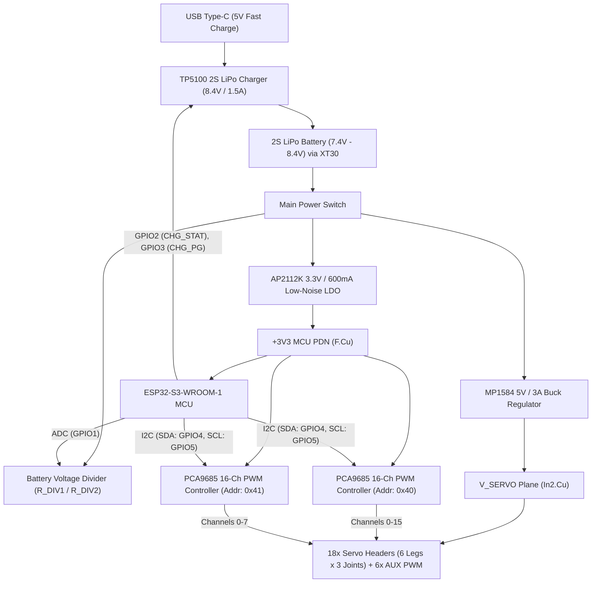

# 18-DOF Hexapod Robot Controller Board

[-brightgreen.svg)]()
[-brightgreen.svg)]()

A fabrication-ready, 4-layer robotics controller PCB designed for an **18-DOF Hexapod Robot**. The board features an **ESP32-S3** microcontroller, dual **PCA9685** 16-channel PWM extenders (18 leg servos + 6 auxiliary PWM channels), an integrated **2S LiPo fast Type-C charger (TP5100)**, a dedicated **5V/3A buck converter (MP1584)** for high-current servo actuation, and battery voltage telemetry.

---

## 3D Board Previews

  

  
  

---

## System Architecture

---

## Key Hardware Features

- **Microcontroller**: ESP32-S3-WROOM-1 (Dual-core Xtensa LX7 @ 240MHz, 2.4GHz Wi-Fi 4, BLE 5, 8MB Flash).
- **Actuation**: Dual PCA9685 12-bit PWM controllers over dedicated I2C bus (`0x40`, `0x41`), capable of controlling 18 leg servos and 6 auxiliary peripherals.
- **Power Management**:
  - **Input**: 2S LiPo battery (7.4V nominal) via horizontal AMASS XT30PW connector.
  - **Charging**: Onboard TP5100 fast switching charger (8.4V CV cutoff, ~1.5A charge rate) with Type-C input and dual LED indicators.
  - **Servo Power**: Dedicated MP1584 buck regulator delivering 5.0V @ 3A continuous (4A peak) into an internal copper power plane.
  - **Logic Power**: AP2112K-3.3V LDO protected with Schottky reverse isolation and 220µF bulk capacitance to prevent brownouts during sudden motor stalls.
  - **Monitoring**: Precision 1% resistor divider (100kΩ / 33kΩ) connected to ESP32-S3 ADC (GPIO1).
- **Physical Specifications**:
  - **Size**: 100.0 mm × 80.0 mm.
  - **Mounting**: 4× M3 mounting holes at `(6.0, 6.0)`, `(94.0, 6.0)`, `(6.0, 74.0)`, and `(94.0, 74.0)`.
  - **Stackup**: 4 Layers (`F.Cu` Signals/PDN, `In1.Cu` Solid GND, `In2.Cu` V_SERVO high-current plane, `B.Cu` Signals).

---

## Servo Channel Mapping

| Leg / Joint | Header Ref | Controller | Channel | I2C Addr |
| :--- | :--- | :--- | :--- | :--- |
| **Right Front (RF) Coxa** | `J_L1_C` | PCA9685 #1 | PWM 0 | `0x40` |
| **Right Front (RF) Femur** | `J_L1_F` | PCA9685 #1 | PWM 1 | `0x40` |
| **Right Front (RF) Tibia** | `J_L1_T` | PCA9685 #1 | PWM 2 | `0x40` |
| **Right Middle (RM) Coxa** | `J_L2_C` | PCA9685 #1 | PWM 3 | `0x40` |
| **Right Middle (RM) Femur** | `J_L2_F` | PCA9685 #1 | PWM 4 | `0x40` |
| **Right Middle (RM) Tibia** | `J_L2_T` | PCA9685 #1 | PWM 5 | `0x40` |
| **Right Rear (RR) Coxa** | `J_L3_C` | PCA9685 #1 | PWM 6 | `0x40` |
| **Right Rear (RR) Femur** | `J_L3_F` | PCA9685 #1 | PWM 7 | `0x40` |
| **Right Rear (RR) Tibia** | `J_L3_T` | PCA9685 #1 | PWM 8 | `0x40` |
| **Left Front (LF) Coxa** | `J_L4_C` | PCA9685 #1 | PWM 9 | `0x40` |
| **Left Front (LF) Femur** | `J_L4_F` | PCA9685 #1 | PWM 10 | `0x40` |
| **Left Front (LF) Tibia** | `J_L4_T` | PCA9685 #1 | PWM 11 | `0x40` |
| **Left Middle (LM) Coxa** | `J_L5_C` | PCA9685 #1 | PWM 12 | `0x40` |
| **Left Middle (LM) Femur** | `J_L5_F` | PCA9685 #1 | PWM 13 | `0x40` |
| **Left Middle (LM) Tibia** | `J_L5_T` | PCA9685 #1 | PWM 14 | `0x40` |
| **Left Rear (LR) Coxa** | `J_L6_C` | PCA9685 #1 | PWM 15 | `0x40` |
| **Left Rear (LR) Femur** | `J_L6_F` | PCA9685 #2 | PWM 0 | `0x41` |
| **Left Rear (LR) Tibia** | `J_L6_T` | PCA9685 #2 | PWM 1 | `0x41` |
| **Auxiliary PWM 1** | `J_AUX1` | PCA9685 #2 | PWM 2 | `0x41` |
| **Auxiliary PWM 2** | `J_AUX2` | PCA9685 #2 | PWM 3 | `0x41` |
| **Auxiliary PWM 3** | `J_AUX3` | PCA9685 #2 | PWM 4 | `0x41` |
| **Auxiliary PWM 4** | `J_AUX4` | PCA9685 #2 | PWM 5 | `0x41` |
| **Auxiliary PWM 5** | `J_AUX5` | PCA9685 #2 | PWM 6 | `0x41` |
| **Auxiliary PWM 6** | `J_AUX6` | PCA9685 #2 | PWM 7 | `0x41` |

---

## Manufacturing Deliverables

All fabrication files are available in the [`fabrication/`](fabrication/) directory:

- **Gerbers & Drill**: [`fabrication/Hexapod_Robot_Board-gerbers.zip`](fabrication/Hexapod_Robot_Board-gerbers.zip)
- **Pick & Place (CPL)**: [`fabrication/Hexapod_Robot_Board-cpl.csv`](fabrication/Hexapod_Robot_Board-cpl.csv)
- **Assembly BOM (JLCPCB)**: [`fabrication/Hexapod_Robot_Board-bom-jlcpcb.csv`](fabrication/Hexapod_Robot_Board-bom-jlcpcb.csv)
- **Full Schematic BOM**: [`fabrication/Hexapod_Robot_Board-bom.csv`](fabrication/Hexapod_Robot_Board-bom.csv)
- **3D Mechanical Model**: [`fabrication/Hexapod_Robot_Board.step`](fabrication/Hexapod_Robot_Board.step)
- **Printable Schematic**: [`fabrication/Hexapod_Robot_Board-schematic.pdf`](fabrication/Hexapod_Robot_Board-schematic.pdf)

---

## Verification & Compliance

- **Electrical Rules Check (ERC)**: Passed with 0 errors, 0 warnings (`Hexapod_Robot_Board-erc.rpt`).
- **Design Rules Check (DRC)**: Passed with 0 violations, 0 unconnected items (`Hexapod_Robot_Board-drc.rpt`).
- **Standard**: Follows JLCPCB 4-Layer 6mil rules (0.15mm clearance, 0.20mm track width, 0.30mm via drill).
