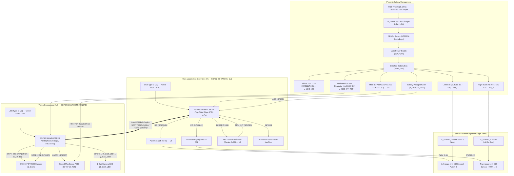

# 18-DOF Hexapod Robot Controller Board (Rev 3.0)

[](https://kicad.org)
[-brightgreen.svg)](reports/Hexapod_Robot_Board-erc.rpt)
[-brightgreen.svg)](reports/Hexapod_Robot_Board-drc.rpt)
[]()
[](fabrication/)
[](LICENSE)

A production-ready, high-power 4-layer robotics controller PCB designed for an **18-DOF Hexapod Robot**. Rev 3.0 is a major architectural upgrade introducing a **dedicated Vision Coprocessor** (second ESP32-S3-WROOM-1U-N8R8), a **BQ25886 2S LiPo fast charger** (replaces TP5100), **triple South-edge USB Type-C ports** (dedicated charging, main MCU, and vision MCU), an **OV3660/OV2640 DVP camera interface** with a 1–3W illumination LED driver, a **Sipeed MaixSense A010 3D ToF** sensor on a fully isolated 5V rail, a **dedicated Vision 3.3V ultra-low-noise LDO**, and an **external power switch connector**. The locomotion subsystem retains the proven dual 5A XL4015 buck split-rail architecture and dual PCA9685 uncrossed PWM routing.

---

## 3D Board Previews

<p align="center">
  
</p>

<p align="center">
  
  
</p>

---

## System Architecture (Rev 3.0)



---

## Key Hardware Features

### Dual-MCU Architecture
- **Main Locomotion MCU (`U1`)**: ESP32-S3-WROOM-1U — Dual-core Xtensa LX7 @ 240 MHz, 2.4 GHz Wi-Fi, BLE 5, 16 MB Flash. Placed on the **Top-Right edge** (`X=88.0, Y=2.5 mm`) with IPEX U.FL antenna facing North.
- **Vision Coprocessor (`U8`)**: ESP32-S3-WROOM-1U-N8R8 — Identical SoC, 8 MB PSRAM (Octal), pin-compatible with Zephyr's `esp32s3_eye` board definition. Placed on the **Top-Left edge** (`X=22.0, Y=2.5 mm`) with IPEX U.FL facing North.
- **Inter-MCU Link**: Full-duplex UART (`U1` GPIO43/44 ↔ `U8` GPIO43/44) at up to 3 Mbps, plus hardware Frame Sync / Alert IRQ (`U8` GPIO21 → `U1` GPIO4).

### Vision & Perception
- **Camera Interface**: 24-pin DVP FPC connector (`J_CAM`, top-centre `X=55.0, Y≈-11.0 mm`, rotated 180°) for OV3660 (3 MP) or OV2640 (2 MP). SCCB I²C via 4.7 kΩ pull-ups (`R_CAM_SCL`, `R_CAM_SDA`).
- **3D ToF Sensor**: Sipeed MaixSense A010 connector (`J_TOF`) at `(5.0, -11.0) mm`, powered by an isolated `+5V_TOF` linear rail with >60 dB PSRR to eliminate servo switching noise.
- **Camera Illumination**: 1–3 W white LED driver via AO3400A N-MOSFET (`Q_CAM_LED`), gate driven by Vision GPIO3 through 100 Ω series (`R_CAM_LED`) + 10 kΩ pull-down (`R_PD_CAM_LED`). External LED connector: `J_CAM_LED`.
- **Status NeoPixel**: WS2812B-2020 (`LED_RGB_MAIN`) driven by Main MCU GPIO48 via 330 Ω damping resistor (`R_NEO`).

### Power Architecture
| Rail | Source | Voltage | Max Current | Consumer |
|:---|:---|:---|:---|:---|
| `+VBAT` | 2S LiPo XT30PW | 6.0–8.4 V | 20 A peak | Raw battery |
| `VBAT_SW` | SW_PWR / J_SW_EXT | 6.0–8.4 V | 15 A | All regulators |
| `V_SERVO_L` | XL4015 Buck L (`U3_L`) | 5.0 V | 5 A cont. / 6 A pk | Left legs + AUX 4–6 |
| `V_SERVO_R` | XL4015 Buck R (`U3_R`) | 5.0 V | 5 A cont. / 6 A pk | Right legs + AUX 1–3 |
| `+3V3` | AP2112K LDO (`U4`) | 3.3 V | 600 mA | Main MCU, PCA9685s, IMU |
| `+3V3_VIS` | AMS1117-3.3 (`U_LDO_VIS`) | 3.3 V | 800 mA | Vision MCU, camera |
| `+5V_TOF` | AMS1117-5.0 (`U_REG_5V_TOF`) | 5.0 V | 800 mA | MaixSense A010 ToF (isolated) |
| `VBUS` | USB-C (`J_CHG`) | 5.0 V | 2.0 A | BQ25886 charger input |

- **Battery Management**: BQ25886 (VQFN-24) 2S LiPo fast charger — replaces TP5100. Supports USB BC1.2 detection, USB OTG boost, PowerPath management. Charge/standby LEDs: `LED_CHG`, `LED_FULL`.
- **External Power Switch**: 2-pin header `J_SW_EXT` allows robot chassis-mounted latching switch to gate `VBAT_SW`. Battery charges safely with electronics fully off.

### Triple South-Edge USB-C
All three USB-C receptacles co-located along the South board edge for a single chassis port bay cutout:
1. **`J_CHG` (`J1`, X≈37 mm)** — Dedicated 2S fast charger input. Zero data lines.
2. **`J_USB_MAIN` (`J2`, X≈95.5 mm)** — Main ESP32-S3 native USB / JTAG / gait telemetry.
3. **`J_USB_VISION` (`J3`, X≈84 mm)** — Vision ESP32-S3 native USB / JTAG / video stream.

### Inertial Measurement Unit
- **MPU-6050** (`U7`) at exact geometric centre of mass (`X=55.0, Y=45.0 mm`) with hardware interrupt to Main MCU GPIO10.

### Physical Specifications
- **Dimensions**: 110.0 × 90.0 mm, 3.0 mm corner radii.
- **Mounting**: 4× M3 holes (3.2 mm drill / 6.0 mm pad) at `(5,5)`, `(105,5)`, `(5,85)`, `(105,85)` mm.
- **Stackup**: 4-layer — `F.Cu` signals/PDN · `In1.Cu` solid GND · `In2.Cu` split `V_SERVO` planes · `B.Cu` GND flood/signals.

---

## Servo Channel Mapping

| Joint / Channel | Header | Controller | Ch | I²C Addr | Rail |
|:---|:---|:---|:---|:---|:---|
| **Right Front (RF) Coxa** | `J_L1_C` | PCA9685 Right (`U6`) | PWM 0 | `0x41` | `V_SERVO_R` |
| **Right Front (RF) Femur** | `J_L1_F` | PCA9685 Right (`U6`) | PWM 1 | `0x41` | `V_SERVO_R` |
| **Right Front (RF) Tibia** | `J_L1_T` | PCA9685 Right (`U6`) | PWM 2 | `0x41` | `V_SERVO_R` |
| **Right Middle (RM) Coxa** | `J_L2_C` | PCA9685 Right (`U6`) | PWM 3 | `0x41` | `V_SERVO_R` |
| **Right Middle (RM) Femur** | `J_L2_F` | PCA9685 Right (`U6`) | PWM 4 | `0x41` | `V_SERVO_R` |
| **Right Middle (RM) Tibia** | `J_L2_T` | PCA9685 Right (`U6`) | PWM 5 | `0x41` | `V_SERVO_R` |
| **Right Rear (RR) Coxa** | `J_L3_C` | PCA9685 Right (`U6`) | PWM 6 | `0x41` | `V_SERVO_R` |
| **Right Rear (RR) Femur** | `J_L3_F` | PCA9685 Right (`U6`) | PWM 7 | `0x41` | `V_SERVO_R` |
| **Right Rear (RR) Tibia** | `J_L3_T` | PCA9685 Right (`U6`) | PWM 8 | `0x41` | `V_SERVO_R` |
| **Left Front (LF) Coxa** | `J_L4_C` | PCA9685 Left (`U5`) | PWM 0 | `0x40` | `V_SERVO_L` |
| **Left Front (LF) Femur** | `J_L4_F` | PCA9685 Left (`U5`) | PWM 1 | `0x40` | `V_SERVO_L` |
| **Left Front (LF) Tibia** | `J_L4_T` | PCA9685 Left (`U5`) | PWM 2 | `0x40` | `V_SERVO_L` |
| **Left Middle (LM) Coxa** | `J_L5_C` | PCA9685 Left (`U5`) | PWM 3 | `0x40` | `V_SERVO_L` |
| **Left Middle (LM) Femur** | `J_L5_F` | PCA9685 Left (`U5`) | PWM 4 | `0x40` | `V_SERVO_L` |
| **Left Middle (LM) Tibia** | `J_L5_T` | PCA9685 Left (`U5`) | PWM 5 | `0x40` | `V_SERVO_L` |
| **Left Rear (LR) Coxa** | `J_L6_C` | PCA9685 Left (`U5`) | PWM 6 | `0x40` | `V_SERVO_L` |
| **Left Rear (LR) Femur** | `J_L6_F` | PCA9685 Left (`U5`) | PWM 7 | `0x40` | `V_SERVO_L` |
| **Left Rear (LR) Tibia** | `J_L6_T` | PCA9685 Left (`U5`) | PWM 8 | `0x40` | `V_SERVO_L` |
| **Auxiliary PWM 1–3** | `J_AUX1–3` | PCA9685 Right (`U6`) | PWM 9–11 | `0x41` | `V_SERVO_R` |
| **Auxiliary PWM 4–6** | `J_AUX4–6` | PCA9685 Left (`U5`) | PWM 9–11 | `0x40` | `V_SERVO_L` |

---

## GPIO Assignments

### Main Locomotion MCU (`U1` — ESP32-S3-WROOM-1U)
| GPIO | Function | Direction | Connected To |
|:---|:---|:---|:---|
| GPIO1 | I2C SCL | Output | PCA9685 L/R, MPU-6050 |
| GPIO41 | I2C SDA | Bidirectional | PCA9685 L/R, MPU-6050 |
| GPIO4 | Frame Sync IRQ | Input | Vision MCU GPIO21 |
| GPIO5 | Battery ADC | Input | `R_DIV1`/`R_DIV2` voltage divider |
| GPIO6 | CHG_STAT | Input | BQ25886 `STAT` pin |
| GPIO7 | CHG_PG | Input | BQ25886 `PG` pin (Power Good) |
| GPIO10 | MPU_INT | Input | MPU-6050 INT |
| GPIO19/20 | USB D-/D+ | Bidirectional | `J_USB_MAIN` (J2) |
| GPIO43 | Inter-MCU TX | Output | Vision MCU GPIO44 |
| GPIO44 | Inter-MCU RX | Input | Vision MCU GPIO43 |
| GPIO48 | NeoPixel Data | Output | `R_NEO` → `LED_RGB_MAIN` |

### Vision Coprocessor (`U8` — ESP32-S3-WROOM-1U-N8R8)
| GPIO | Function | Direction | Connected To |
|:---|:---|:---|:---|
| GPIO1 | ToF UART RX | Input | A010 TX (UART1) |
| GPIO2 | ToF UART TX | Output | A010 RX (UART1) |
| GPIO3 | Camera LED PWM | Output | `R_CAM_LED` → `Q_CAM_LED` gate |
| GPIO4 | SCCB SDA (I2C1) | Bidirectional | Camera SIOD, 4.7 kΩ pull-up |
| GPIO5 | SCCB SCL (I2C1) | Output | Camera SIOC, 4.7 kΩ pull-up |
| GPIO6 | DVP VSYNC | Input | Camera VSYNC |
| GPIO7 | DVP HREF | Input | Camera HREF |
| GPIO8–13 | DVP D2–D7 | Input | Camera Y4–Y9 |
| GPIO15 | DVP XCLK | Output | Camera XCLK (10–24 MHz) |
| GPIO16–18 | DVP D0–D2 | Input | Camera Y2–Y4 |
| GPIO19/20 | USB D-/D+ | Bidirectional | `J_USB_VISION` (J3) |
| GPIO21 | Frame Sync IRQ | Output | Main MCU GPIO4 |
| GPIO38 | Camera PWDN | Output | Camera PWDN, 10 kΩ pull-down |
| GPIO43 | Inter-MCU TX | Output | Main MCU GPIO44 |
| GPIO44 | Inter-MCU RX | Input | Main MCU GPIO43 |

---

## Project Structure

```
Hexapod_Robot_Board/
├── Hexapod_Robot_Board.kicad_pro       # Master KiCad 10.0.6 project file
├── Hexapod_Robot_Board.kicad_sch       # Rev 3.0 schematic (dual-MCU, triple USB-C)
├── Hexapod_Robot_Board.kicad_pcb       # 4-layer routed PCB layout
├── Hexapod_Robot_Board.net             # Complete netlist (98 nets)
├── README.md                           # This document
├── 3dmodels/                           # Custom 3D STEP component packages
│   ├── ESP32-S3-WROOM-1U.step
│   ├── MPU-6050.step
│   ├── LED_WS2812B-2020.step
│   └── Hirose_FH12-24S-0.5SH_1x24-1MP_P0.50mm_Horizontal.step
├── fabrication/                        # Manufacturing deliverable package
│   ├── Hexapod_Robot_Board-gerbers.zip
│   ├── Hexapod_Robot_Board-cpl-jlcpcb.csv
│   ├── Hexapod_Robot_Board-bom-jlcpcb.csv
│   ├── Hexapod_Robot_Board.step
│   ├── Hexapod_Robot_Board_Schematic.pdf
│   └── *.png                           # 2D + 3D renders
├── reports/                            # Verification reports
│   ├── Hexapod_Robot_Board-drc.rpt
│   ├── Hexapod_Robot_Board-erc.rpt
│   └── Hexapod_Robot_Board-stats.txt
└── scripts/                            # Python automation suite
    ├── export_fabrication.py           # One-click manufacturing pipeline
    ├── run_final_perfect_route.py      # Freerouting solver
    └── README.md
```

---

## Verification & Compliance

- **ERC**: Passed — **0 errors, 0 warnings** ([`reports/Hexapod_Robot_Board-erc.rpt`](reports/Hexapod_Robot_Board-erc.rpt)).
- **DRC**: Passed — **0 violations, 0 unconnected items** ([`reports/Hexapod_Robot_Board-drc.rpt`](reports/Hexapod_Robot_Board-drc.rpt)).
- **Manufacturability**: JLCPCB / PCBWay 4-layer standard constraints (0.15 mm clearance, 0.20 mm min track, 0.30 mm min drill, 45° mitered geometry).

---

## Revision History

| Rev | Date | Summary |
|:---|:---|:---|
| **3.0** | 2026-10-04 | Vision Coprocessor (ESP32-S3-WROOM-1U-N8R8), BQ25886 2S charger, triple South USB-C, DVP camera, MaixSense A010 ToF on isolated +5V rail, dedicated Vision 3.3V LDO, camera LED driver, inter-MCU UART link, external power switch header, WS2812B NeoPixel. Schematic/PCB annotated and synced. |
| **2.0** | 2026-10-01 | ESP32-S3-WROOM-1U, dual XL4015 5A buck split rails, MPU-6050 at CoM, South-edge USB-C charging via TP5100, dual PCA9685 uncrossed PWM, 4-layer routing, 0 DRC/ERC. |
| **1.0** | 2026-09-28 | Initial 18-DOF hexapod controller. ESP32-S3, single buck, TP5100 charger, dual PCA9685. |
