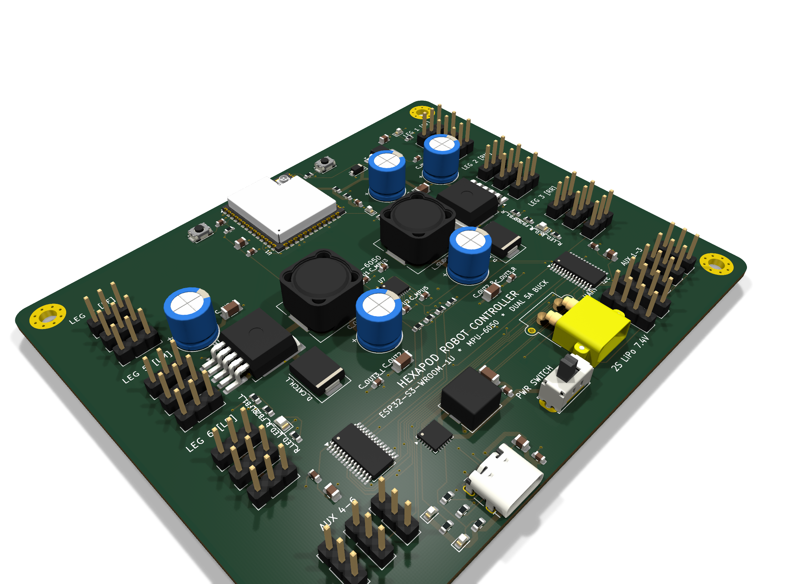
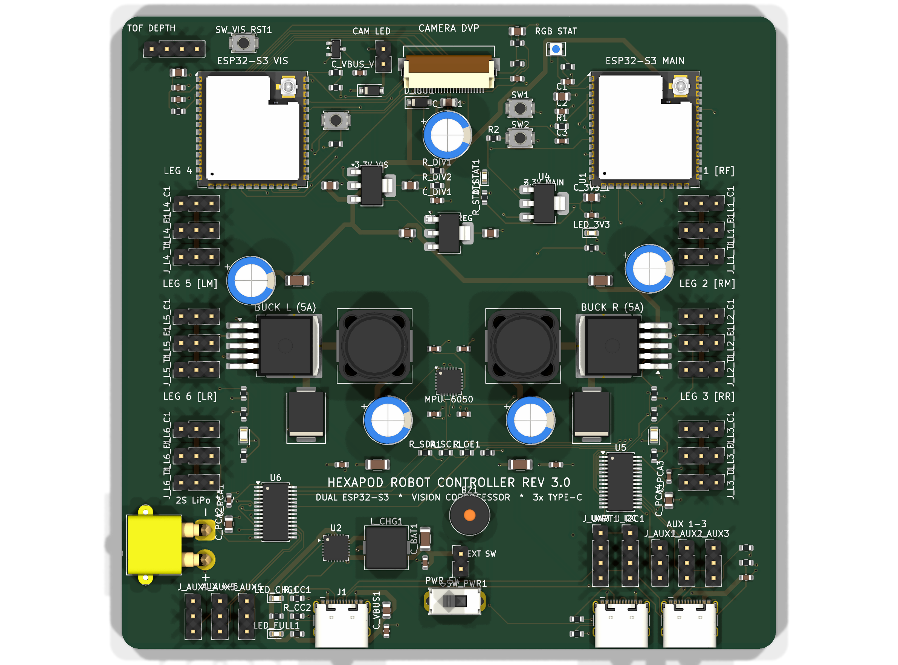
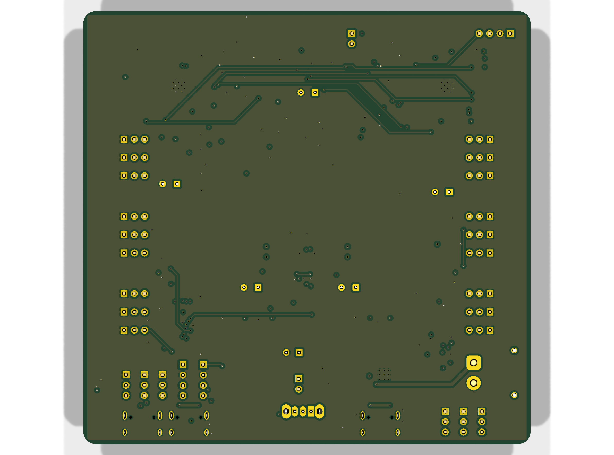

# 18-DOF Hexapod Robot Controller Board (Rev 2.0)

[](https://kicad.org)
[-brightgreen.svg)](reports/Hexapod_Robot_Board-erc.rpt)
[-brightgreen.svg)](reports/Hexapod_Robot_Board-drc.rpt)
[]()
[](fabrication/)
[](LICENSE)

A production-ready, high-power 4-layer robotics controller PCB designed for an **18-DOF Hexapod Robot**. Rev 2.0 introduces an **ESP32-S3-WROOM-1U** (external IPEX / U.FL antenna), **dual 5A XL4015 buck regulators** (split Left/Right leg power rails for up to 10A continuous / 20A peak servo actuation), an onboard **InvenSense MPU-6050 6-axis IMU** at the geometric center of rotation, **South-edge USB Type-C charging**, dual **PCA9685** 16-channel PWM extenders (24 servo/aux channels total), and integrated 2S LiPo battery management.

---

## 3D Board Previews

<p align="center">
  
</p>

<p align="center">
  
  
</p>

---

## System Architecture (Rev 2.0)

```mermaid
flowchart TD
    USB["USB Type-C (South Edge, J1)"] --> U2["TP5100 2S LiPo Charger (8.4V / 1.5A)"]
    BAT["2S LiPo Battery (XT30PW, South Edge)"] --> SW_PWR["Main Power Switch (SW_PWR)"]
    U2 --> BAT
    
    SW_PWR --> VBAT_SW["Switched Battery Bus (VBAT_SW)"]
    VBAT_SW --> BUCK_L["Left Buck Regulator (XL4015, 5V / 5A)"]
    VBAT_SW --> BUCK_R["Right Buck Regulator (XL4015, 5V / 5A)"]
    VBAT_SW --> DIV["Battery Voltage Divider (R_DIV1 / R_DIV2)"]
    VBAT_SW --> LDO["AMS1117-3.3V Low-Noise LDO"]
    
    BUCK_L --> V_SERVO_L["V_SERVO_L Plane (In2.Cu Left)"]
    V_SERVO_L --> SERVOS_L["Left Legs 4, 5, 6 (9 Servos) + AUX 4-6"]
    
    BUCK_R --> V_SERVO_R["V_SERVO_R Plane (In2.Cu Right)"]
    V_SERVO_R --> SERVOS_R["Right Legs 1, 2, 3 (9 Servos) + AUX 1-3"]
    
    LDO --> V33["+3V3 Logic PDN (Top Layer F.Cu)"]
    V33 --> U1["ESP32-S3-WROOM-1U (North Edge, IPEX U.FL)"]
    V33 --> U5["PCA9685 Left (16-Ch PWM, Addr: 0x40)"]
    V33 --> U6["PCA9685 Right (16-Ch PWM, Addr: 0x41)"]
    V33 --> U7["MPU-6050 6-Axis IMU (Center of Mass, Addr: 0x68)"]
    
    U1 -- "I2C (SCL: GPIO1, SDA: GPIO41)" --> U5
    U1 -- "I2C (SCL: GPIO1, SDA: GPIO41)" --> U6
    U1 -- "I2C (SCL: GPIO1, SDA: GPIO41)" --> U7
    U1 -- "MPU_INT (GPIO10)" <-- U7
    U1 -- "ADC (GPIO5)" --> DIV
    U1 -- "Native USB D+/D-" --> USB
    U1 -- "GPIO6 (CHG_STAT), GPIO7 (CHG_PG)" --> U2
    
    U5 -- "PWM 0-8" --> SERVOS_L
    U5 -- "PWM 9-14" --> SERVOS_L
    U6 -- "PWM 0-8" --> SERVOS_R
    U6 -- "PWM 9-14" --> SERVOS_R
```

---

## Key Hardware Features

- **Microcontroller**: ESP32-S3-WROOM-1U (Dual-core Xtensa LX7 @ 240MHz, 2.4GHz Wi-Fi, BLE 5, 16MB Flash, 8MB PSRAM) placed flush on the North board edge with an external IPEX / U.FL antenna port facing outward.
- **Inertial Measurement Unit**: Onboard InvenSense MPU-6050 6-axis gyroscope and accelerometer located at the exact geometric center of mass ($X = 55.0\,\text{mm}, Y = 45.0\,\text{mm}$), with dedicated decoupling and hardware interrupt to ESP32 GPIO10.
- **High-Current Dual Power Architecture**:
  - **Left Rail (`V_SERVO_L`)**: Dedicated XL4015 5A buck regulator powering Legs 4, 5, 6 and AUX 4, 5, 6.
  - **Right Rail (`V_SERVO_R`)**: Dedicated XL4015 5A buck regulator powering Legs 1, 2, 3 and AUX 1, 2, 3.
  - **Layer 3 (`In2.Cu`)**: Split dedicated copper power planes with short switching loops and low thermal resistance.
- **Battery Management & Charging**:
  - **Input**: 2S LiPo battery (7.4V nominal) via horizontal AMASS XT30PW connector on the South edge.
  - **USB-C Charging**: Relocated to the South edge for single-edge cable management. Driven by an onboard TP5100 fast charger (8.4V CV, ~1.5A charge rate) with charge/standby status LEDs.
- **Servo Actuation**: Dual PCA9685 12-bit PWM controllers over shared I2C bus (`0x40`, `0x41`), controlling 18 leg servos and 6 auxiliary servo channels.
- **Physical Specifications**:
  - **Dimensions**: $110.0\,\text{mm} \times 90.0\,\text{mm}$ with $3.0\,\text{mm}$ corner radii.
  - **Mounting**: 4× M3 mounting holes ($3.2\,\text{mm}$ drill / $6.0\,\text{mm}$ annular pad) at `(5.0, 5.0)`, `(105.0, 5.0)`, `(5.0, 85.0)`, and `(105.0, 85.0)`.
  - **Stackup**: 4 Layers (`F.Cu` Signals/PDN, `In1.Cu` Solid GND, `In2.Cu` Split V_SERVO Planes, `B.Cu` Solid GND/Signals).

---

## Servo Channel Mapping

| Joint / Channel | Header Ref | Controller | Channel | I2C Addr | Power Rail |
| :--- | :--- | :--- | :--- | :--- | :--- |
| **Right Front (RF) Coxa** | `J_L1_C` | PCA9685 Right (`U6`) | PWM 0 | `0x41` | `V_SERVO_R` (5A) |
| **Right Front (RF) Femur** | `J_L1_F` | PCA9685 Right (`U6`) | PWM 1 | `0x41` | `V_SERVO_R` (5A) |
| **Right Front (RF) Tibia** | `J_L1_T` | PCA9685 Right (`U6`) | PWM 2 | `0x41` | `V_SERVO_R` (5A) |
| **Right Middle (RM) Coxa** | `J_L2_C` | PCA9685 Right (`U6`) | PWM 3 | `0x41` | `V_SERVO_R` (5A) |
| **Right Middle (RM) Femur** | `J_L2_F` | PCA9685 Right (`U6`) | PWM 4 | `0x41` | `V_SERVO_R` (5A) |
| **Right Middle (RM) Tibia** | `J_L2_T` | PCA9685 Right (`U6`) | PWM 5 | `0x41` | `V_SERVO_R` (5A) |
| **Right Rear (RR) Coxa** | `J_L3_C` | PCA9685 Right (`U6`) | PWM 6 | `0x41` | `V_SERVO_R` (5A) |
| **Right Rear (RR) Femur** | `J_L3_F` | PCA9685 Right (`U6`) | PWM 7 | `0x41` | `V_SERVO_R` (5A) |
| **Right Rear (RR) Tibia** | `J_L3_T` | PCA9685 Right (`U6`) | PWM 8 | `0x41` | `V_SERVO_R` (5A) |
| **Left Front (LF) Coxa** | `J_L4_C` | PCA9685 Left (`U5`) | PWM 0 | `0x40` | `V_SERVO_L` (5A) |
| **Left Front (LF) Femur** | `J_L4_F` | PCA9685 Left (`U5`) | PWM 1 | `0x40` | `V_SERVO_L` (5A) |
| **Left Front (LF) Tibia** | `J_L4_T` | PCA9685 Left (`U5`) | PWM 2 | `0x40` | `V_SERVO_L` (5A) |
| **Left Middle (LM) Coxa** | `J_L5_C` | PCA9685 Left (`U5`) | PWM 3 | `0x40` | `V_SERVO_L` (5A) |
| **Left Middle (LM) Femur** | `J_L5_F` | PCA9685 Left (`U5`) | PWM 4 | `0x40` | `V_SERVO_L` (5A) |
| **Left Middle (LM) Tibia** | `J_L5_T` | PCA9685 Left (`U5`) | PWM 5 | `0x40` | `V_SERVO_L` (5A) |
| **Left Rear (LR) Coxa** | `J_L6_C` | PCA9685 Left (`U5`) | PWM 6 | `0x40` | `V_SERVO_L` (5A) |
| **Left Rear (LR) Femur** | `J_L6_F` | PCA9685 Left (`U5`) | PWM 7 | `0x40` | `V_SERVO_L` (5A) |
| **Left Rear (LR) Tibia** | `J_L6_T` | PCA9685 Left (`U5`) | PWM 8 | `0x40` | `V_SERVO_L` (5A) |
| **Auxiliary PWM 1-3** | `J_AUX1-3` | PCA9685 Right (`U6`) | PWM 9-11 | `0x41` | `V_SERVO_R` (5A) |
| **Auxiliary PWM 4-6** | `J_AUX4-6` | PCA9685 Left (`U5`) | PWM 9-11 | `0x40` | `V_SERVO_L` (5A) |

---

## Project Structure

```
Hexapod_Robot_Board/
├── Hexapod_Robot_Board.kicad_pro       # Master KiCad 10.0 project file
├── Hexapod_Robot_Board.kicad_sch       # Rev 2.0 multi-sheet schematic
├── Hexapod_Robot_Board.kicad_pcb       # 4-layer routed PCB layout (0 DRC violations)
├── Hexapod_Robot_Board.net             # Complete netlist
├── Hexapod_Robot_Board-drc.rpt         # Root DRC verification report
├── Hexapod_Robot_Board-erc.rpt         # Root ERC verification report
├── README.md                           # Documentation & specifications
├── 3dmodels/                           # Custom 3D STEP component packages
├── fabrication/                        # Complete manufacturing deliverable package
│   ├── Hexapod_Robot_Board-gerbers.zip # RS-274X Gerbers + Excellon drills
│   ├── Hexapod_Robot_Board-cpl-jlcpcb.csv # SMT Pick-and-Place list
│   ├── Hexapod_Robot_Board-bom-jlcpcb.csv # Grouped BOM with LCSC part numbers
│   ├── Hexapod_Robot_Board-pos.csv     # Standard KiCad component position data
│   ├── Hexapod_Robot_Board-bom.csv     # Standard KiCad BOM
│   ├── Hexapod_Robot_Board.step        # 3D mechanical STEP CAD model
│   ├── Hexapod_Robot_Board_Schematic.pdf # Vector schematic documentation
│   ├── Hexapod_Robot_Board-stats.txt   # Board layer and geometric statistics
│   └── *.png                           # High-resolution 2D and 3D raytraced renders
├── reports/                            # Verification and audit reports
│   ├── Hexapod_Robot_Board-drc.rpt     # Full DRC report (0 errors, 0 unconnected)
│   ├── Hexapod_Robot_Board-erc.rpt     # Full ERC report (0 errors, 0 warnings)
│   └── Hexapod_Robot_Board-stats.txt   # Physical PCB statistics
└── scripts/                            # Standalone Python automation suite
    ├── export_fabrication.py           # Automated one-click manufacturing pipeline
    ├── run_final_perfect_route.py      # Freerouting solver + layer transition patches
    ├── solve_perfect_board.py          # Prerouting and zone definition solver
    ├── route_power_primitives.py       # Parametric high-current power routing library
    ├── generate_perfect_schematic.py   # Schematic generation and symbol wiring
    └── README.md                       # Script documentation and execution guide
```

---

## Verification & Compliance

- **Electrical Rules Check (ERC)**: Passed with **0 errors, 0 warnings** ([`reports/Hexapod_Robot_Board-erc.rpt`](reports/Hexapod_Robot_Board-erc.rpt)).
- **Design Rules Check (DRC)**: Passed with **0 violations, 0 unconnected items, 0 footprint errors** ([`reports/Hexapod_Robot_Board-drc.rpt`](reports/Hexapod_Robot_Board-drc.rpt)).
- **Manufacturability**: Built to JLCPCB / PCBWay standard 4-layer constraints ($0.15\,\text{mm}$ trace clearance, $0.20\,\text{mm}$ minimum track width, $0.30\,\text{mm}$ drill diameter, $45^\circ$ mitered geometry).
